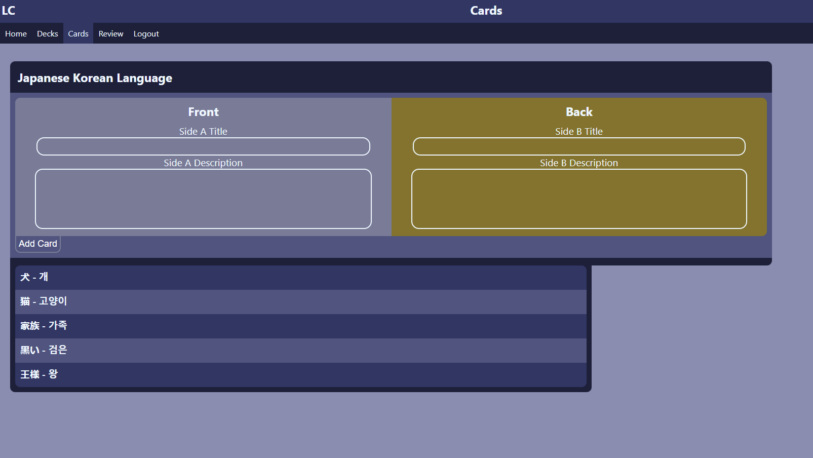
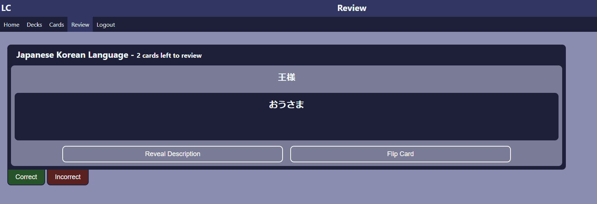

# Loquacious Cards
  ## Table of Contents
  
  - [Description](#description)
  - [Usage](#usage)
  - [Technologies](#technologies)
  - [Contributing](#contributing)
  - [Deployment](#deployment)
  - [Github](#github)
  
  ## Description
 
A simple online flashcard program which can be used to help memorize anything you want! Simply sign in from anywhere and create, build, and review decks of flashcards!

  ## Usage
  
  Sign up for a new account by clicking on the signup button. Once you have created an account you will have full access to create decks and fill them with cards to review!
  
  ## Technologies

    - HTML5
    - CSS 3
    - JavaScript
    - Mongodb
    - React
    - Apollo-client
    - Graphql

  ## Contributing
    

- William Bolls https://github.com/palminski

  
  ## Images

  
  

  ## Deployment

  [Heroku](https://loquacious-conversationalist.herokuapp.com/)

  ## Github

  [GitHub](https://github.com/palminski/loquacious-conversationalist)

